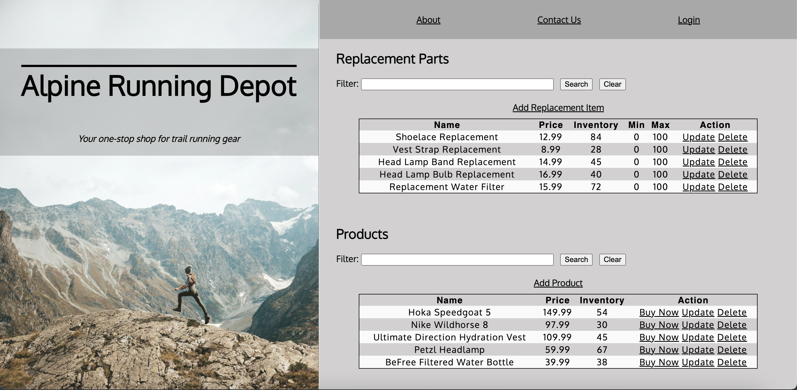
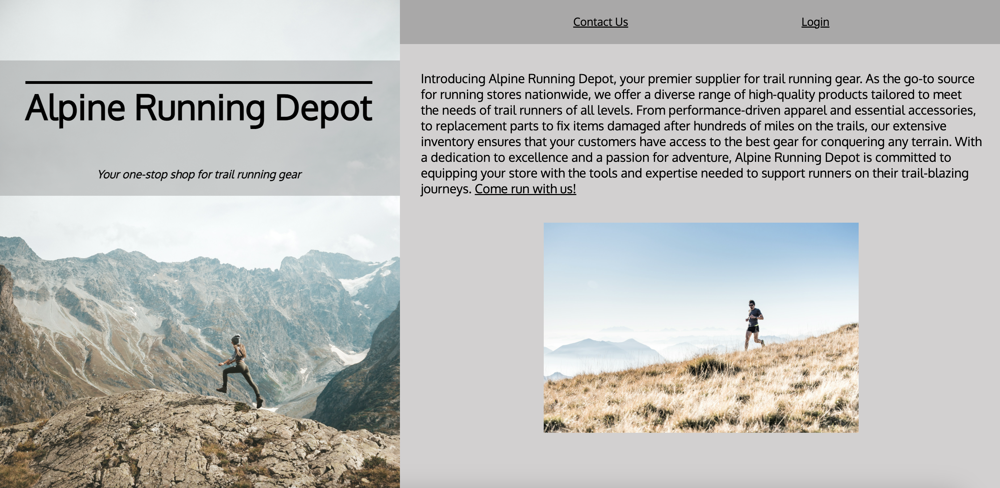
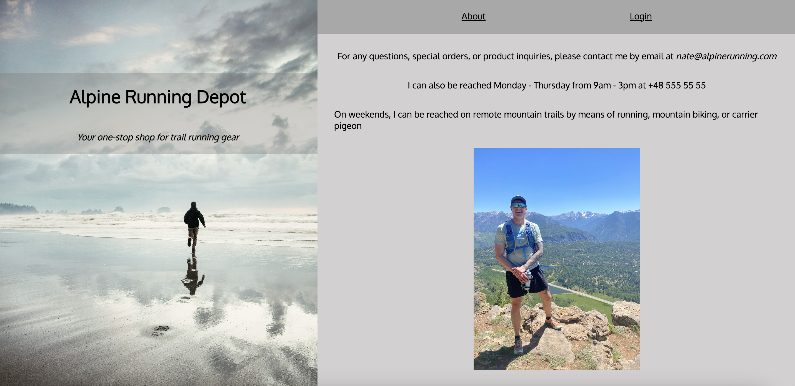
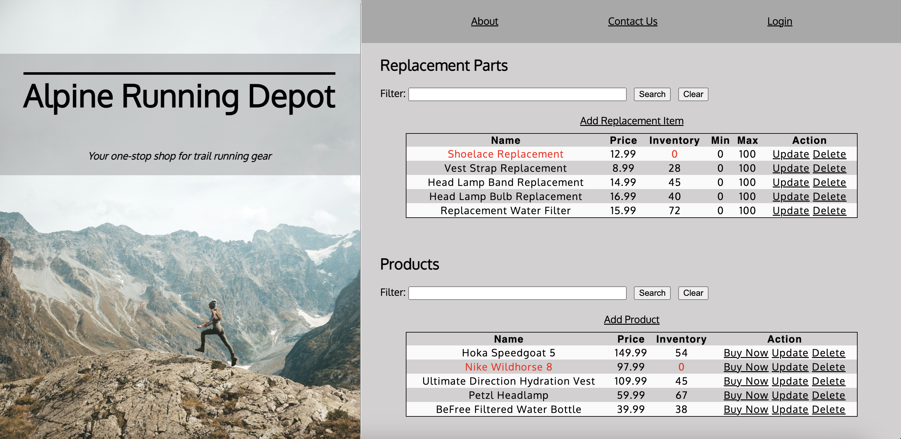
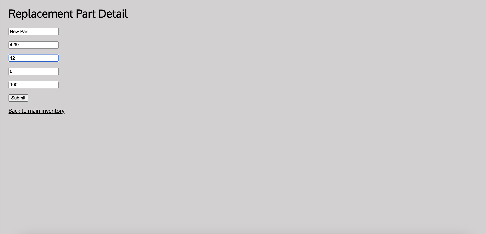
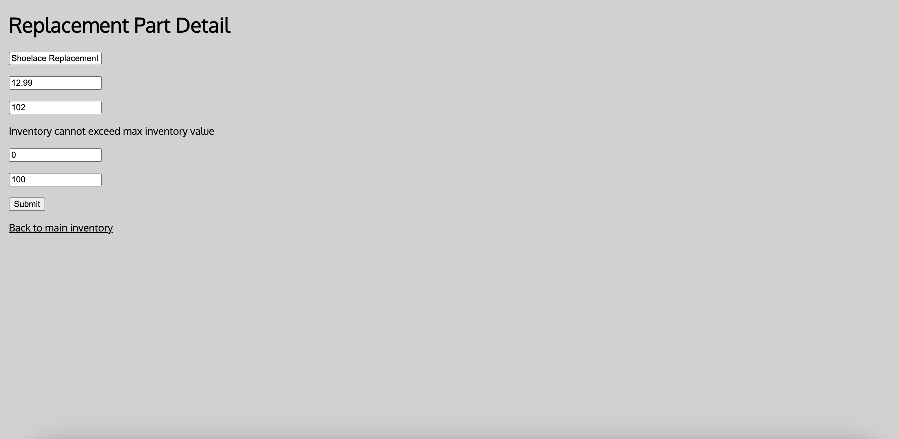
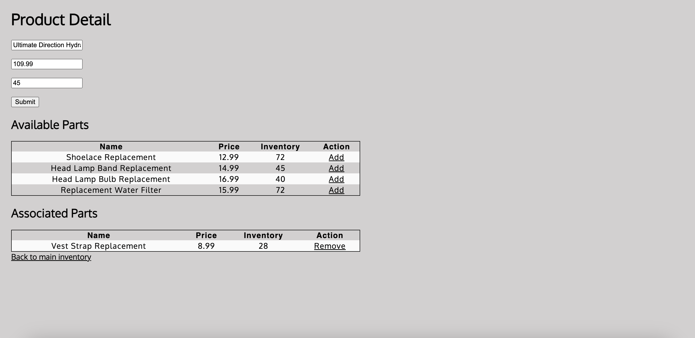
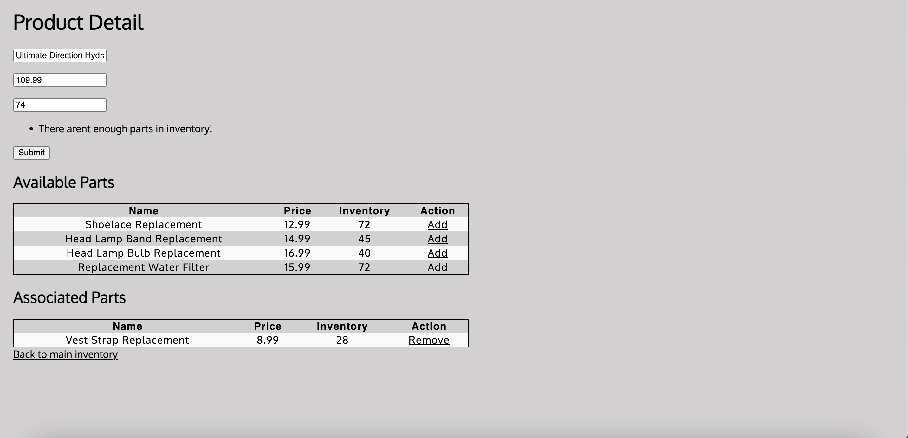
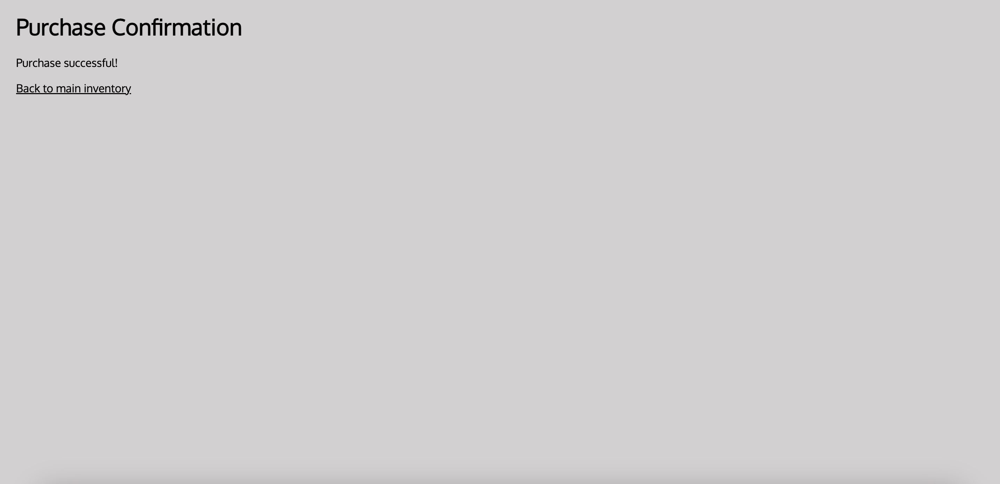
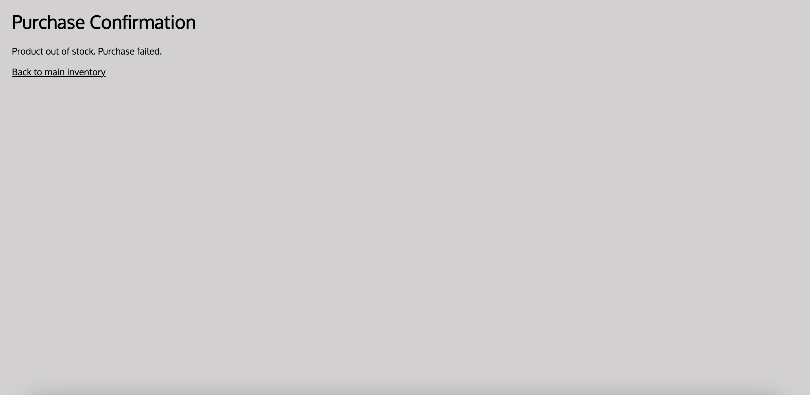

# *Alpine Running* Store Inventory Spring Boot Application

**Tech Description:** This is a full-stack Spring Boot
Application with an HTML front-end and Java back-end. The application
stores data in an H2 SQL database engine.

**Application Description:** Alpine Running Depot is a fictitious, online 
trail running supply store. The website includes a main screen that allows a user to add,
delete, and update replacement parts and product inventory. It also includes an about page 
with a link to a sign up page, an about page for users that already have an account, a login 
page, and a Contact Us page. 

# Added Files:
Controllers:
<ul>
<li>About Controller</li>
<li>Contact Controller</li>
<li>Guest About Controller</li>
<li>Login Controller</li>
</ul>
Static:
<ul>
<li>Images Directory</li>
<li>Script Directory (w/ Script.js file)</li>
</ul>
Templates:
<ul>
<li>About.html</li>
<li>Contact.html</li>
<li>guestAbout.html</li>
<li>Login.html</li>
<li>purchaseConfirmation.html</li>
</ul>

# Removed Files:
<ul>
<li>DeletePartValidator Class</li>
</ul>

# Code Changes:
Spring Boot Application: 
<ul>
<li>Rename application to AlpineRunningDepot</li>
</ul>

Bootstrap:
<ul>
<li>Create new Outsource Parts Objects (Lines 44-48)</li>
<li>Line 51 (commented out) allows the user to reset the sample inventory</li>
<li>Write an if statement that adds the new Parts objects to the OutsourcedParts 
repository if the Parts repository is empty (Lines 53-59)</li>
<li>Create new Products Objects (Lines 63-67)</li>
<li>Line 70 (commented out) allows the user to reset the sample inventory</li>
<li>Write an if statement that adds the new Products objects to the Parts 
repository if the Products repository is empty (Lines 72-77)</li>
</ul>

Added Controllers:
<ul>
<li>About Controller</li>
<li>Contact Controller</li>
<li>Guest About Controller</li>
<li>Login Controller</li>
</ul>
The above controllers were added and use Controller Annotation and @RequestMapping to 
provide active links to the html pages: about.html, contact.html, guestAbout.html, and login.html

Controllers:
<ul>
<li>AddProductController:</li>
<ul>
<li>Added BuyProductNow Controller to decrement 
purchased product inventory by 1 and map to the newly created 
purchaseConfirmation.html file. (Lines 118 - 133)</li>
<li>Create validateInventory() method to use EnufPartsValidator 
in AddProduct Controller (Lines 198 - 200)</li>
<li>Create updatePartInventory() method to use display warning 
if entered product inventory exceeds max value (Lines 203 - 209)</li>
</ul>
<li>AddInHousePartController: Add submit form class to allow user 
to enter minimum and maximum values and verify that it 
is within the min / max parameters(Lines 33 - 52) </li>
<li>AddOutsourcePartController: Add submit form class to allow user 
to enter minimum and maximum values and verify that it 
is within the min / max parameters(Lines 36 - 51) </li>
</ul>

Domain:
<ul>
<li>Add overloaded OutsourcePart.java Constructor (Lines 20-22)</li>
<li>Add overloaded InHousePart.java Constructor (Lines 20-22)</li>
</ul>
<ul>
<li>Part.java:</li>
<ul>
<li>Add minInventory Variable (Lines 33-34)</li>
<li>Add maxInventory Variable (Lines 36-37)</li>
<li>Add min/max variables to overloaded Part
Constructors (Lines 51, 52, 60, 61)</li>
<li>Create minInventory setter (Lines 96, 97)</li>
<li>Create minInventory getter (Lines 108, 109)</li>
<li>Create maxInventory setter (Lines 100, 101)</li>
<li>Create maxInventory getter (Lines 112, 113)</li>
<li>Write code to enforce min and maximum value (Lines 104, 105)</li>
</ul>
</ul>

Static/CSS:
<ul>
<li>Renamed Demo.css to Style.css</li>
<li>(Full Style Sheet) Restyled web pages: color, images, layout, design, color, 
and added images</li>
</ul>

Static/Images:
<ul>
<li>Added images directory</li>
<li>Added images to Main Screen (Inventory), About Pages, Contact Page, 
and Login Page</li>
<li>Add screenshots to demo app</li>
</ul>

Static/Script:
<ul>
<li>Created a script directory to store newly created script.js JavaScript file</li>
<li>Created custom JavaScript Functions:</li>
<ul>
<li>updateTableOverflow(): This function prevents the tables from overflowing, or "spilling", 
out of the designated container (div) by adding a table overflow: scroll property to both
the product and the parts inventory tables on the main screen when the tables have a height 
greater than 176px (roughly 7 rows + a table head). These changes affect the mainscreen.html 
file and affect the tables on lines 56-81 and lines 104-128. This function can be found on
Lines 4-11 and is called on Line 34 of script.js</li>
<li>displayAlert(): This function displays an alert when the two dummy links "Forgot Password" 
and "Sign Up" are clicked on the login page. This alert informs the user that the links do not 
work, as this is not a real website. These changes affect the login.html file and affect the 
"Forgot Password" link on Line 37 and the "Sign Up" link on Line 44. This function can be found on
Lines 14-16 on script.js</li>
<li>noInventory(): This function changes the font color of the name and inventory number
of any item on the parts or product table where the inventory number is equal to zero. The font color
is changed to red to indicate that the item is out of stock. This function can be found on
Lines 19-29 and is called on Line 34 of script.js</li>
</ul>
</ul>

H2 Database:
<ul>
<li>Rename Database File: spring-boot-h2-database</li>
<li>Use ALTER TABLE Command to add Min_Inventory and Max_Inventory to parts database schema</li>
</ul>

Resources/application.properties: 
<ul>
<li>Renamed the database file: jdbc:h2:file:~/spring-boot-h2-database (Line 6)</li>
<li>Add spring.jpa.hibernate.dialect=org.hibernate.dialect.H2Dialect (Line 14)</li>
</ul>

Resources/Templates: 
<ul>
<li>Structural Changes to mainscreen.html:</li>
<ul>
<li><strong>This page can be accessed by searching 'http://localhost:8080' after running
the Spring Boot Application. It can also be reached by clicking the Test Drive button on 
Line 50 of login.html</strong></li>
<li>Link Stylesheet (style.css) on Line 11</li>
<li>Link JavaScript File (script.js) on Line 12</li>
<li>Change title to Alpine Running (Line 13)</li>
<li>Wrap body in container div (Line 17)</li>
<li>Separate into left and right containers (Lines 18, 28)</li>
<li>Add a top and bottom container to left container for h1 and 
sub-header (Lines 19-25)</li>
<li>Add header with href links to About, Contact Us, and Login pages (Lines 29 - 39)</li>
<li>Wrap Replacement Parts section in a div called parts (Line 40)</li>
<li>Wrap Add Item Links in a div (Line 51) </li>
<li>Change "Add In-House Item" to "Add Replacement Item" (Line 52)</li>
<li>Comment out the outsourced item link on Line 53 (Line 53) </li>
<li>Wrap Replacement Item Inventory Table in a div called inventory-table (Line 55)</li>
<li>This table uses the custom JavaScript functions updateTableOverflow()
and noInventory(). They can be found in static/script.js</li>
<li>Add Min and Max to Parts Table Head (Lines 63, 64)</li>
<li>Add Min and Max Values to Parts Table (Lines 72, 73)</li>
<li>Wrap Products section in a div called products (Line 84)</li>
<li>Wrap Add Product in a div called add item (Line 100)</li>
<li>Wrap Product Inventory Table in a div called inventory-table (Line 103)</li>
<li>This table uses the custom JavaScript functions updateTableOverflow()
and noInventory(). They can be found in static/script.js</li>
<li>Create "Buy Now" button (Line 120)</li>
</ul>
<li>Changes to InHousePartForm.html:</li>
<ul>
<li>Link stylesheet (Line 7)</li>
<li>Wrap form in a div called parts form (Line 11)</li>
<li>Add min and max values for in house part form (Lines 26-31)</li>
<li>Map Display Error messages to InHousePartForm (Line 27, 31)</li>
</ul>
<li>Changes to OutsourcedPartForm.html:</li>
<ul>
<li>Link stylesheet (Line 7)</li>
<li>Wrap form in a div called parts form (Line 11)</li>
<li>Add min and max values for outsourced part form (Lines 26-31)</li>
<li>Map Display Error messages to InHousePartForm (Line 27, 31)</li>
</ul>
</ul>

Added Templates:
All added templates can be accessed by use of the following created controllers: AboutController, 
ContactController, GuestAboutController, and LoginController.
<li>Added guestAbout.html:</li>
<ul>
<li>(Part D) This page describes the website to users and includes a stock photo, a header, and links 
to the Main Screen (called inventory), Login and Contact pages. This page does <strong>not</strong> include
a link to login.html</li>
<li><strong>This page can be reached by clicking the "About" Header on the mainscreen.</strong></li>
</ul>
<li>Added about.html:</li>
<ul>
<li>This page describes the website to users and includes a stock photo, a header, and links 
to the Login and Contact pages. This page <strong>does</strong> include
a link to login.html</li>
<li><strong>This page can be reached by clicking the "About" link in the header on the login.html page
or the "About" link in the header on the contact.html page.</strong></li>
</ul>
<li>Added contact.html:</li>
<ul>
<li>This page includes pretend contact information, a header containing links to about.html and login.html, 
and an image.</li>
<li><strong>This page can be reached by clicking the "Contact" link in the header on the mainscreen.html,
login.html, about.html, and guest.html pages.</strong></li>
</ul>
<li>Added login.html:</li>
<ul>
<li>This page includes a login screen, a Test Drive link to mainscreen.html, two dummy links that display
an alert using the custom displayAlert() JavaScript function, and a header with links to the about.html
and contact.html pages.</li>
<li><strong>This page can be reached by clicking the "Login" link in the header on the mainscreen.html,
contact.html, about.html, and guest.html pages.</strong></li>
</ul>

# Code Description (Rubric Requirements)
**(C) Customize HTML user interface:** All details of changes can be found in the above 'Code Changes'
section.

**(D) Add an About Page:** All details of about pages can be found in the above 'Code Changes' section.
The About page can also be accessed [here](http://localhost:8080/guestAbout). Code for the About page
can be accessed [here](src/main/resources/templates/guestAbout.html).

**(E) Add A Sample Parts and Products Inventory:** This section can be found in the BootStrapData.java 
file (Lines 41-75). An if statement is used to display the sample inventories when the parts and products
lists are empty. A commented out reset can be used to reset both part and product repositories (Lines 48, 67)

**(F) Add A Buy Now Button To Product List:**
<ul>
<li>The Buy Now Button can be found on mainscreen.html on Line 116</li>
<li>The buy now button maps to purchaseConfirmation.html</li>
<li>The Buy Now button uses the BuyProductNow Controller to decrement 
items by 1 each time they are purchased. This can be found on controllers/AddProductController.java 
(Lines 117 - 132)</li>
<li>A purchase successful or purchase failed message is displayed 
on purchaseConfirmation.html This can be found on controllers/AddProductController.java
(Lines 126, 128)</li>
</ul>

**(G) Modify Parts to track max and min inventory**
<ul>
<li>Add additional fields to the part entity for maximum and minimum inventory:</li>
<ul>
<li>Add max and min inventory fields to domain/Part.java
(Lines 33-38)</li>
<li>Add fields to overloaded Parts Constructor in domain/Part.java (Lines 47-62) </li>
</ul>
<li>Modify the sample inventory to include the maximum and minimum fields:</li>
<ul>
<li>Changes found in bootstrap/BootStrapData.java (Lines 41-45)</li>
<li>Changes found in template/mainscreen.html (Lines 72, 73)</li>
</ul>
<li>Add to the InhousePartForm and OutsourcedPartForm forms additional text inputs for 
the inventory so the user can set the maximum and minimum values: </li>
<ul>
<li>Changes found in templates/InHousePartForm 
and templates/OutsourcedPartForm (Lines 26-30)</li>
</ul>
<li>Rename the file the persistent storage is saved to:</li>
<ul>
<li>Changes found in resources/application.properties (Line 6)</li>
<li>Changed H2 Database name to spring-boot-h2-database</li>
</ul>
<li>Modify the code to enforce that the inventory is between or at 
the minimum and maximum value:</li>
<ul>
<li>Create isInventoryValid() method to ensure inventory is between 
minimum and maximum value range. Code found in domain/Part.java (Lines 104-106)</li>
<li>Add ternary operator to minInventory getter to enforce 
minimum inventory value. Code found in domain/Part.java (Line 109)</li>
<li>Add ternary operator to maxInventory getter to enforce 
maximum inventory value. Code found in domain/Part.java (Line 113)</li>
<li>Add submit form class to allow to enforce minimum and maximum values. 
Code found in AddInhousePartController (Lines 33-52)</li>
<li>Add submit form class to allow to enforce minimum and maximum values.
Code found in AddOutsourcedPartController (Lines 36-52)</li>
</ul>
</ul>

**(H) Add validation for min / max fields**
<ul>
<li>Display error message for low inventory when adding/updating parts if inventory less
than minimum number of parts</li>
<ul>
<li>Use isInventoryValid to enforce min range and display error message. Code found in 
AddInHousePartController (Lines 40-43)</li>
<li>Use isInventoryValid to enforce min range and display error message. Code found in 
AddOutsourcedPartController (Lines 43-46)</li>
<li>Add Error Message for @Min and @Max annotations in 
Part.Java (Lines 33)</li>
<li>Map Error messages to templates/InHousePartForm (Lines 27)</li>
<li>Map Error messages to templates/OutsourcedPartForm (Lines 27)</li>
</ul>
<li>Display error message for low inventory when adding/updating products lowers the part
inventory below the minimum</li>
<ul>
<li>Create validateInventory() method to use EnufPartsValidator 
in AddProductController (Lines 197-200)</li>
<li>Create updatePartInventory() method to update part inventory
when a part is attached to a product and the product inventory
is increased (Lines 202 -211)</li>
</ul>
<li>Display error message for low inventory when adding/updating parts if inventory 
greater than maximum number of parts</li>
<ul>
<li>Use isInventoryValid to enforce max range and display error message. Code found in 
AddInHousePartController (Lines 40-43)</li>
<li>Use isInventoryValid to enforce max range and display error message. Code found in 
AddOutsourcedPartController (Lines 43-46)</li>
<li>Add Error Message for @Min and @Max annotations in 
Part.Java (Lines 36)</li>
<li>Map Error messages to templates/InHousePartForm (Lines 31)</li>
<li>Map Error messages to templates/OutsourcedPartForm (Lines 31)</li>
</ul>
</ul>

**(I) Add Two Units Tests for Min/Max Fields to the PartTest class in test package**
<ul>
<li>Test 1: Minimum Inventory Unit Test</li>
<ul>
<li>Unit testMinInventory() found in PartTest.java (Lines 161 - 168)</li>
</ul>
</ul>
<ul>
<li>Test 2: Maximum Inventory Unit Test</li>
<ul>
<li>Unit testMaxInventory() found in PartTest.java (Lines 170 - 177)</li>
</ul>
</ul>

**(J) Removed class files for unused validators:**
<ul>
<li>Remove DeletePartValidator Class</li>
</ul>

# Images
The image used in contact.html on Line 45 is my own.
 
All other images are free, stock photos downloaded from Unsplash.com

# Screenshots

